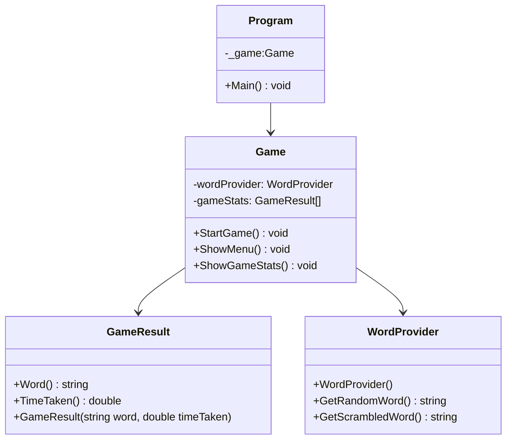

```mermaid

classDiagram
    class Game {
    -wordProvider: WordProvider
    -gameStats: GameResult[]

    +StartGame() void
    +ShowMenu() void
    +ShowGameStats() void
    }

    class GameResult {
    +Word() string
    +TimeTaken() double
    +GameResult(string word, double timeTaken)
    }

    class WordProvider {

    +WordProvider()
    +GetRandomWord() string
    +GetScrambledWord() string
    }

    class Program {
    -_game:Game

    +Main() void
    }

    Game --> GameResult
    Game --> WordProvider
    Program --> Game

```